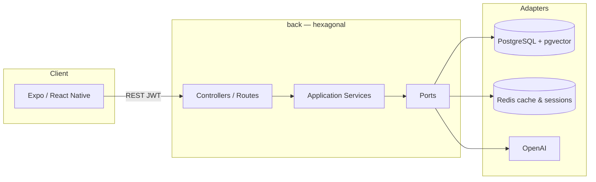

# Let Me Cook

Application mobile de cuisine intelligente : inventaire frigo, appareils, listes de courses et suggestions de recettes assistées par IA.

Monorepo composé d’une API Node.js (architecture hexagonale) et d’une application Expo / React Native.

## Features

| Domaine | Capacités |
| --- | --- |
| **Authentification** | Inscription, connexion JWT, sessions Redis |
| **Frigo** | CRUD des ingrédients, dates d’expiration, analyse IA |
| **Appareils** | Inventaire des équipements de cuisine |
| **Recettes** | CRUD, recherche de similarité via embeddings (pgvector) |
| **Courses** | Listes, items, recherche, articles fréquents, images IA |
| **IA** | Suggestions de recettes, analyse, génération de listes |

## Stack

| Couche | Technologies |
| --- | --- |
| Mobile | Expo 57, React Native 0.86, React 19, Expo Router, React Query, Zustand, Zod 4, React Native Paper |
| API | Node.js 22+, Express 5, TypeScript 5.9, Prisma 7, JWT, bcrypt |
| Données | PostgreSQL + pgvector, Redis 6 |
| IA | OpenAI (embeddings + chat) |
| Qualité | Jest (API + mobile), ESLint |

## Structure

```
let-me-cook/
├── back/                 API Express (hexagonale)
│   ├── prisma/           Schema & migrations
│   ├── src/
│   │   ├── domain/
│   │   ├── application/
│   │   ├── infrastructure/
│   │   ├── controllers/
│   │   └── routes/
│   ├── docker-compose.yml
│   └── Dockerfile*
└── front-mobile/         Application Expo
    ├── app/              Routes & features
    ├── hooks/
    ├── services/
    ├── stores/
    └── lib/
```

## Prérequis

- **Node.js** ≥ 22
- **npm** ≥ 10
- **Docker** & Docker Compose (PostgreSQL, Redis)
- Compte **OpenAI** (clé API)
- Expo Go ou émulateur iOS / Android

## Démarrage

### 1. Cloner le dépôt

```bash
git clone https://github.com/ioTactile/let-me-cook.git
cd let-me-cook
```

### 2. Infrastructure locale

```bash
cd back
cp .env.example .env   # si présent ; sinon créer depuis le tableau ci-dessous
docker compose up -d postgres redis
```

### 3. Backend

```bash
cd back
npm install
npx prisma migrate dev
npm run dev
```

API disponible sur `http://localhost:8000`.

### 4. Application mobile

```bash
cd front-mobile
cp .env.example .env.development
# Renseigner API_URL (ex. http://<IP-locale>:8000/api)
npm install
npm start
```

Puis ouvrir Expo Go, un émulateur, ou le web (`npm run web`).

### Variables d’environnement

#### Backend (`back/.env`)

| Variable | Description |
| --- | --- |
| `DATABASE_URL` | Connexion PostgreSQL |
| `REDIS_URL` | Connexion Redis (défaut `redis://localhost:6379`) |
| `JWT_SECRET` | Secret de signature JWT |
| `SESSION_SECRET` | Secret des sessions Express |
| `OPENAI_API_KEY` | Clé API OpenAI |
| `PORT` | Port HTTP (défaut `8000`) |
| `FRONTEND_URL` | Origine CORS (ex. `http://localhost:8081`) |
| `NODE_ENV` | `development` \| `production` |

#### Mobile (`front-mobile/.env.development`)

| Variable | Description |
| --- | --- |
| `API_URL` | Base URL de l’API (ex. `http://192.168.x.x:8000/api`) |

> Sur un appareil physique, utilisez l’IP LAN de la machine hôte, pas `localhost`.

### Déploiement backend

```bash
cd back
npm run deploy         # docker-compose.prod.yml up -d
npm run deploy:logs
npm run deploy:down
```

Voir `back/Dockerfile.prod`, `back/nginx.conf` et `back/docker-compose.prod.yml` pour le détail.

## Scripts

### Backend (`back/`)

| Commande | Description |
| --- | --- |
| `npm run dev` | Serveur de développement (nodemon) |
| `npm run build` | Compilation TypeScript |
| `npm start` | Production (`dist/`) |
| `npm test` | Tests unitaires Jest |
| `npm run lint` | ESLint |
| `npm run prisma:migrate` | Migrations |
| `npm run prisma:studio` | UI Prisma |

### Mobile (`front-mobile/`)

| Commande | Description |
| --- | --- |
| `npm start` | Expo Dev Server |
| `npm run android` | Android |
| `npm run ios` | iOS |
| `npm run web` | Web |
| `npm test` | Jest |
| `npm run test:watch` | Jest en mode watch |

## Architecture



- **Backend** — `domain` → `application` (ports + services) → `infrastructure` (adapters) → `controllers` / `routes`
- **Mobile** — écrans Expo Router, hooks React Query, client Axios, stores Zustand

API REST base `/api` — routes protégées : header `Authorization: Bearer <token>`. Collection HTTP : [`back/rest-client.http`](back/rest-client.http).

## Licence

MIT License — see [LICENSE](./LICENSE).
