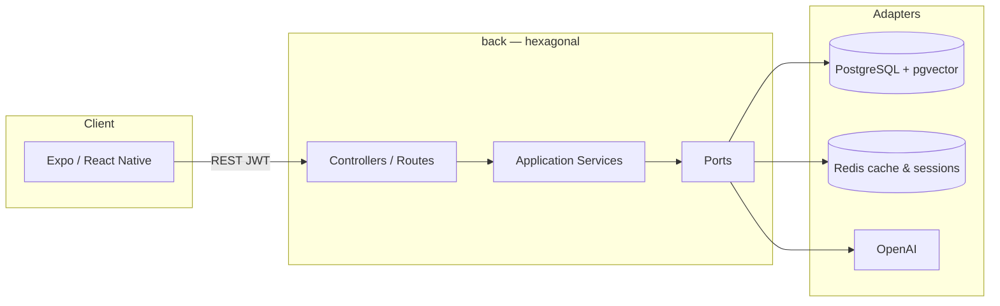

# Let Me Cook

Application mobile de cuisine intelligente : inventaire frigo, appareils, listes de courses et suggestions de recettes assistées par IA.

Monorepo composé d’une API Node.js (architecture hexagonale) et d’une application Expo / React Native.

---

## Fonctionnalités

| Domaine | Capacités |
|--------|-----------|
| **Authentification** | Inscription, connexion JWT, sessions Redis |
| **Frigo** | CRUD des ingrédients, dates d’expiration, analyse IA |
| **Appareils** | Inventaire des équipements de cuisine |
| **Recettes** | CRUD, recherche de similarité via embeddings (pgvector) |
| **Courses** | Listes, items, recherche, articles fréquents, images IA |
| **IA** | Suggestions de recettes, analyse, génération de listes |

---

## Architecture



### Backend (`back/`)

```
domain/           Erreurs métier, enums
application/      Ports (interfaces) + services (cas d’usage)
infrastructure/   Adapters Prisma, OpenAI, Redis, composition root
controllers/      Adaptateurs HTTP
routes/           Wiring Express
```

Les contrôleurs dépendent du **container** DI ; la persistance et l’IA sont injectées derrière des ports.

### Mobile (`front-mobile/`)

```
app/              Écrans Expo Router + mutations / schemas Zod
hooks/            Lectures React Query
services/         Client HTTP Axios
stores/           Auth & UI (Zustand)
lib/query-keys.ts Clés de cache centralisées
```

---

## Stack technique

| Couche | Technologies |
|--------|----------------|
| Mobile | Expo 57, React Native 0.86, React 19, Expo Router, React Query, Zustand, Zod 4, React Native Paper |
| API | Node.js 22+, Express 5, TypeScript 5.9, Prisma 7, JWT, bcrypt |
| Données | PostgreSQL + pgvector, Redis 6 |
| IA | OpenAI (embeddings + chat) |
| Qualité | Jest (API + mobile), ESLint |

---

## Prérequis

- **Node.js** ≥ 22
- **npm** ≥ 10
- **Docker** & Docker Compose (PostgreSQL, Redis)
- Compte **OpenAI** (clé API)
- Expo Go ou émulateur iOS / Android

---

## Démarrage rapide

### 1. Cloner le dépôt

```bash
git clone https://github.com/ioTactile/let-me-cook.git
cd let-me-cook
```

### 2. Infrastructure locale

```bash
cd back
cp .env.example .env   # si présent ; sinon créer depuis le tableau ci-dessous
docker compose up -d postgres redis
```

### 3. Backend

```bash
cd back
npm install
npx prisma migrate dev
npm run dev
```

API disponible sur `http://localhost:8000`.

### 4. Application mobile

```bash
cd front-mobile
cp .env.example .env.development
# Renseigner API_URL (ex. http://<IP-locale>:8000/api)
npm install
npm start
```

Puis ouvrir Expo Go, un émulateur, ou le web (`npm run web`).

---

## Variables d’environnement

### Backend (`back/.env`)

| Variable | Description |
|----------|-------------|
| `DATABASE_URL` | Connexion PostgreSQL |
| `REDIS_URL` | Connexion Redis (défaut `redis://localhost:6379`) |
| `JWT_SECRET` | Secret de signature JWT |
| `SESSION_SECRET` | Secret des sessions Express |
| `OPENAI_API_KEY` | Clé API OpenAI |
| `PORT` | Port HTTP (défaut `8000`) |
| `FRONTEND_URL` | Origine CORS (ex. `http://localhost:8081`) |
| `NODE_ENV` | `development` \| `production` |

### Mobile (`front-mobile/.env.development`)

| Variable | Description |
|----------|-------------|
| `API_URL` | Base URL de l’API (ex. `http://192.168.x.x:8000/api`) |

> Sur un appareil physique, utilisez l’IP LAN de la machine hôte, pas `localhost`.

---

## API REST

Base : `/api` — routes protégées : header `Authorization: Bearer <token>`.

| Préfixe | Description |
|---------|-------------|
| `POST /auth/register` | Inscription |
| `POST /auth/login` | Connexion |
| `POST /auth/logout` | Déconnexion |
| `GET  /auth/me` | Profil courant |
| `/fridge` | Inventaire frigo (+ `/expiring`) |
| `/appliances` | Appareils |
| `/recipes` | Recettes (+ `POST /similar`) |
| `/shopping-lists` | Listes de courses, items, recherche |
| `/ai` | Suggestions / analyse / listes IA |

Collection HTTP de référence : [`back/rest-client.http`](back/rest-client.http).

---

## Scripts

### Backend

```bash
npm run dev            # serveur de développement (nodemon)
npm run build          # compilation TypeScript
npm start              # production (dist/)
npm test               # tests unitaires Jest
npm run lint           # ESLint
npm run prisma:migrate # migrations
npm run prisma:studio  # UI Prisma
```

### Mobile

```bash
npm start              # Expo Dev Server
npm run android        # Android
npm run ios            # iOS
npm run web            # Web
npm test               # Jest
npm run test:watch     # Jest en mode watch
```

---

## Qualité

Pré-commit (Husky) à la racine :

```bash
npx lint-staged
```

Configure dans [`lint-staged.config.mjs`](lint-staged.config.mjs) : ESLint `--fix` sur les fichiers `back/src` stagés. Après clone : `npm install` (racine) active les hooks via le script `prepare`.

---

## Structure du dépôt

```
let-me-cook/
├── back/                 API Express (hexagonale)
│   ├── prisma/           Schema & migrations
│   ├── src/
│   │   ├── domain/
│   │   ├── application/
│   │   ├── infrastructure/
│   │   ├── controllers/
│   │   └── routes/
│   ├── docker-compose.yml
│   └── Dockerfile*
└── front-mobile/         Application Expo
    ├── app/              Routes & features
    ├── hooks/
    ├── services/
    ├── stores/
    └── lib/
```

---

## Déploiement

Le backend dispose de compositions Docker de production :

```bash
cd back
npm run deploy         # docker-compose.prod.yml up -d
npm run deploy:logs
npm run deploy:down
```

Voir `back/Dockerfile.prod`, `back/nginx.conf` et `back/docker-compose.prod.yml` pour le détail (API, reverse proxy, monitoring).

---

## Licence

Projet privé — tous droits réservés.
